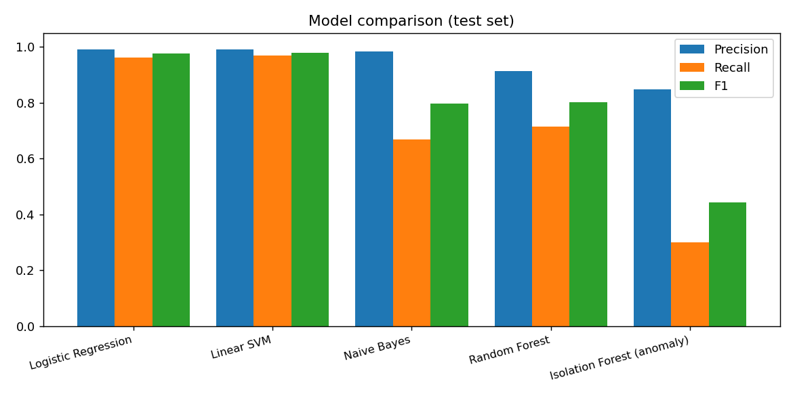
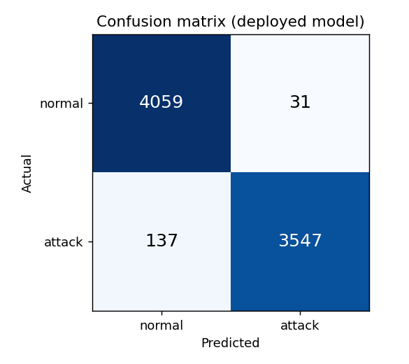
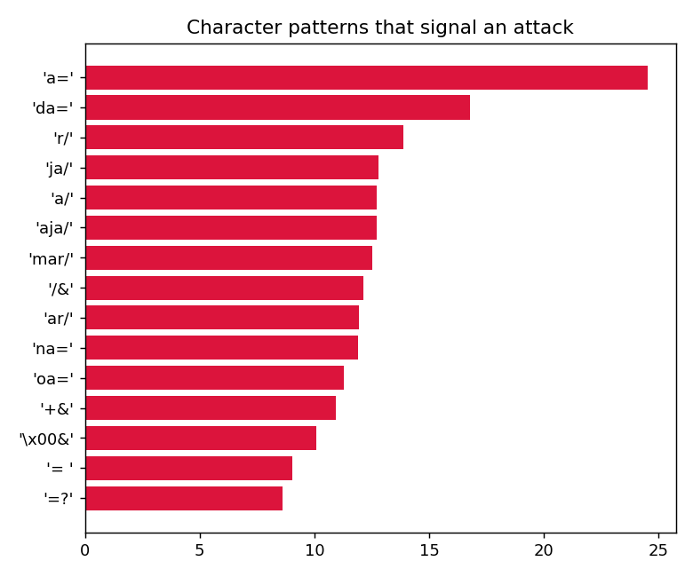

# Evaluation Report - Intelligent Web Attack Detection

## 1. Data and preprocessing
- **Real data:** CSIC 2010 HTTP dataset (public) - 34,594 unique requests after removing duplicates.
- **Synthetic data:** generic requests (/login, /search ...) with SQLi, XSS, path traversal, command injection.
- **Cleaning:** removed empty rows and duplicate requests (duplicates would leak between train and test), URL-decoded twice.
- **Split:** 80% training (31092 requests) / 20% test (7774 requests), stratified.

## 2. Features
- **Text (NLP):** TF-IDF on character n-grams (length 2-4).
- **Security features (12):** length, number of parameters, special characters, quotes, angle brackets, SQL keywords, SQL tautology (OR 1=1), SQL comments, XSS keywords, traversal patterns, shell-command patterns, percent-encoded characters.

## 3. Model comparison (test set)
| Model | Precision | Recall (Detection Rate) | F1 | False Positive Rate | False Negative Rate | ROC-AUC |
|---|---|---|---|---|---|---|
| Logistic Regression | 0.9913 | 0.9628 | 0.9769 | 0.0076 | 0.0372 | 0.9981 |
| Linear SVM | 0.9906 | 0.9680 | 0.9791 | 0.0083 | 0.0320 | 0.9988 |
| Naive Bayes | 0.9836 | 0.6694 | 0.7966 | 0.0100 | 0.3306 | 0.9465 |
| Random Forest | 0.9129 | 0.7142 | 0.8014 | 0.0614 | 0.2858 | 0.8981 |
| Isolation Forest (anomaly) | 0.8476 | 0.3005 | 0.4437 | 0.0487 | 0.6995 | 0.7655 |

## 4. Deployed model: Logistic Regression
| Metric | Value |
|---|---|
| Precision | 0.9913 |
| Recall = Detection Rate | 0.9628 |
| F1-score | 0.9769 |
| False Positive Rate | 0.0076 |
| False Negative Rate | 0.0372 |
| TP / FP / TN / FN | 3547 / 31 / 4059 / 137 |

| Test subset | Precision | Recall | F1 | FPR | FNR |
|---|---|---|---|---|---|
| synthetic | 1.0000 | 1.0000 | 1.0000 | 0.0000 | 0.0000 |
| csic2010 | 0.9900 | 0.9571 | 0.9732 | 0.0083 | 0.0429 |

## 5. Security interpretation
- **False Positive Rate (0.76%)**: share of normal requests wrongly blocked - keeps real users happy.
- **False Negative Rate (3.72%)**: share of attacks that got through. Most misses are subtle CSIC "parameter tampering" requests without an obvious payload.
- **Why Logistic Regression is deployed:** almost as accurate as Linear SVM, but it outputs a probability (our risk score) and its weights show which patterns caused the alert (explainability).
- **Random Forest / Naive Bayes** are weaker because they use only one kind of feature. **Isolation Forest** (anomaly detection, no labels) is weakest but needs no attack examples.
- The synthetic subset scores ~100% because it is simple and repetitive; the CSIC result is the honest, harder benchmark.

## 6. Limitations and future work
- CSIC 2010 is old and covers a single web shop.
- The attack family (SQLi, XSS ...) is decided by simple rules on the features, because CSIC only has normal/attack labels.
- Future: newer datasets, HTTP header features, deep learning, drift monitoring.
